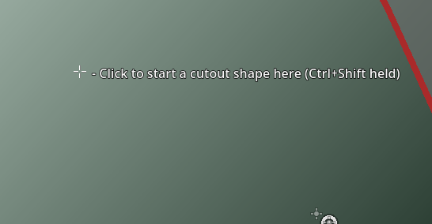

# Scalable Vector Shapes 2D plugin for Godot 4.4

Scalable Vector Shapes 2D lets you do 3 things:
1. Draw seamless vector shapes using a Path Editor inspired by the awesome [Inkscape](https://inkscape.org/) with a new node type: [`ScalableVectorShape2D`](./addons/curved_lines_2d/scalable_vector_shape_2d.gd)[^1]
2. Animate the shape of the curve using keyframes on a [property-track](https://docs.godotengine.org/en/stable/tutorials/animation/introduction.html#doc-introduction-animation)  in an [`AnimationPlayer`](https://docs.godotengine.org/en/stable/classes/class_animationplayer.html#class-animationplayer)
3. Import [.svg](https://www.w3.org/TR/SVG/) files as seamless vector shapes in stead of as raster images[^2]

[^2]: __Important sidenote__: _This plugin only supports a small - yet relevant - subset of the huge [SVG Specification](https://www.w3.org/TR/SVG/struct.html)_

## Watch the A-Z explainer on Youtube

In this 10 minute video I explain how to use all the features of Scalable Vector Shapes 2D in short succession:

[^1]: Looking for EZ Curved Lines 2D? The renamed plugin deprecates the old [`DrawablePath2D`](./addons/curved_lines_2d/drawable_path_2d.gd) custom node in favor of `ScalableVectorShape2D`. A Conversion button is provided: [converter button](./addons/curved_lines_2d/screenshots/00-converter.png). The reason is that [`ScalableVectorShape2D`](./addons/curved_lines_2d/scalable_vector_shape_2d.gd) inherits directly from `Node2D` giving much more control to the plugin over how you can draw.

# Table of Contents

- [Scalable Vector Shapes 2D plugin for Godot 4.4](#scalable-vector-shapes-2d-plugin-for-godot-44)
	- [Watch the A-Z explainer on Youtube](#watch-the-a-z-explainer-on-youtube)
- [Table of Contents](#table-of-contents)
- [Drawing Shapes in the Godot 2D Viewport](#drawing-shapes-in-the-godot-2d-viewport)
	- [Basic Drawing Explainer on youtube](#basic-drawing-explainer-on-youtube)
- [Generating a Circle, Ellipse or Rectangle using the bottom panel item](#generating-a-circle-ellipse-or-rectangle-using-the-bottom-panel-item)
	- [Creating Paths based on Bézier curves](#creating-paths-based-on-bézier-curves)
	- [Creating 'primitive' scapes: Rectangle and Ellipse](#creating-primitive-scapes-rectangle-and-ellipse)
- [Using the `.svg` importer](#using-the-svg-importer)
	- [Known issues explainer on Youtube:](#known-issues-explainer-on-youtube)
- [Manipulating shapes](#manipulating-shapes)
	- [Adding a point to a shape](#adding-a-point-to-a-shape)
	- [Bending a curve](#bending-a-curve)
	- [Creating, mirroring and dragging control point handles](#creating-mirroring-and-dragging-control-point-handles)
	- [Closing the loop and breaking the loop](#closing-the-loop-and-breaking-the-loop)
	- [Deleting points and control points](#deleting-points-and-control-points)
	- [Setting the global position of a point / curve handle manually](#setting-the-global-position-of-a-point--curve-handle-manually)
	- [Create a cutout shape (a hole)](#create-a-cutout-shape-a-hole)
	- [Converting a line segment into an arc-segment](#converting-a-line-segment-into-an-arc-segment)
	- [Editing arc properties](#editing-arc-properties)
	- [Setting the pivot of your shape](#setting-the-pivot-of-your-shape)
- [Manipulating gradients](#manipulating-gradients)
	- [Changing the start- and endpoint of the gradient](#changing-the-start--and-endpoint-of-the-gradient)
	- [Changing the color stop positions](#changing-the-color-stop-positions)
	- [Add new color stops](#add-new-color-stops)
- [The Project Settings in the Scalable Vector Shapes panel](#the-project-settings-in-the-scalable-vector-shapes-panel)
- [Ways to prevent 'over-selecting' `ScalableVectorShape2D` nodes](#ways-to-prevent-over-selecting-scalablevectorshape2d-nodes)
- [Using the Inspector Form for `ScalableVectorShape2D`](#using-the-inspector-form-for-scalablevectorshape2d)
	- [Inspector Form](#inspector-form)
		- [Convert to Path button](#convert-to-path-button)
		- [Export as PNG button](#export-as-png-button)
	- [The Fill inspector form](#the-fill-inspector-form)
	- [The Stroke inspector form](#the-stroke-inspector-form)
	- [The Collision inspector form](#the-collision-inspector-form)
	- [The Navigation inspector form](#the-navigation-inspector-form)
	- [The Curve settings inspector form](#the-curve-settings-inspector-form)
	- [The Shape type inspector form](#the-shape-type-inspector-form)
	- [The Editor settings inspector form](#the-editor-settings-inspector-form)
- [More about assigned `Line2D`, `Polygon2D` and `CollisionObject2D`](#more-about-assigned-line2d-polygon2d-and-collisionobject2d)
	- [Watch the chapter about working with collisions, paint order and the node hierarchy on youtube](#watch-the-chapter-about-working-with-collisions-paint-order-and-the-node-hierarchy-on-youtube)
- [Animating / Changing shapes at runtime](#animating--changing-shapes-at-runtime)
	- [Youtube explainer on animating](#youtube-explainer-on-animating)
	- [A note up front (this being said)](#a-note-up-front-this-being-said)
	- [Animating the shape and gradients at Runtime](#animating-the-shape-and-gradients-at-runtime)
	- [Add keyframes in an animation player](#add-keyframes-in-an-animation-player)
	- [Don't duplicate `ScalableVectorShape2D`, use the `path_changed` signal in stead](#dont-duplicate-scalablevectorshape2d-use-the-path_changed-signal-in-stead)
	- [Performance impact](#performance-impact)
- [Attributions](#attributions)
	- [Lots of thanks go out to those who helped me out getting started:](#lots-of-thanks-go-out-to-those-who-helped-me-out-getting-started)
	- [And a big thank you goes to to @MewPurPur](#and-a-big-thank-you-goes-to-to-mewpurpur)
	- [And of course everyone who helped test and review the code thus far](#and-of-course-everyone-who-helped-test-and-review-the-code-thus-far)
- [Reaching out / Contributing](#reaching-out--contributing)

# Drawing Shapes in the Godot 2D Viewport

## Basic Drawing Explainer on youtube

After activating this plugin a new bottom panel item appears, called "Scalable Vector Graphics".

There are 2 recommended ways to start drawing:
1. [Creating a Circle/Ellipse, Rectangle or empty Path using the bottom panel item](#generating-a-circle-ellipse-or-rectangle-using-the-bottom-panel-item)
2. [Using the `.svg` importer](#using-the-svg-importer)

# Generating a Circle, Ellipse or Rectangle using the bottom panel item

The  `Scalable Vector Shapes` bottom panel gives you some basic choices:

## Creating Paths based on Bézier curves

Pressing the `Create Empty Path` or one of the `Create Path` buttons will add a new shape to an open `2D Scene` in 'Path' mode, meaning all points in the 'Bézier' curve are editable.

## Creating 'primitive' scapes: Rectangle and Ellipse

It's probably easier to start out with a basic primitive shape (like you would in Inkscape <3) using the `Create Rectangle` or `Create Ellipse` button. This will expose less features, but will make it a lot easier to manipulate shapes:

Ellipses will only have one handle to change the `size` property with (representing the x and y diameter). This will set the `rx` and `ry` property indirectly.

Rectangles will have a handle for `size` and 2 handles for rounded corners `rx` and `ry` property.

# Using the `.svg` importer

As mentioned in the introduction, the `.svg` import supports a small - _yet relevant_ - subset of the [W3C specification](https://www.w3.org/TR/SVG/).

That being said, it's still pretty cool and serves my purposes quite well. You can drag any `.svg` resource file into the first tab of the bottom dock to see if it works for you too:

On the left side of this panel is a form with a couple of options you can experiment with. On the right side is an import log, which will show warnings of known problems, usually unsupported stuff:

As the link in the log suggest, you can report [issues](https://github.com/Teaching-myself-Godot/ez-curved-lines-2d/issues) on github; be sure to check if something is already listed.

Don't let that stop you, though, your future infinite zoomer and key-frame animator will love you for it.

## Known issues explainer on Youtube:

# Manipulating shapes

The hints in the 2D viewport should have you covered, but this section lists all the operations available to you. You can also watch the chapter on sculpting paths on youtube:

## Adding a point to a shape

Using `Ctrl`[^5] + `Left Click` you can add a point anywhere in the 2D viewport, while your shape is selected.

[^5]: Use `Cmd` in stead of `Ctrl` on a mac

By double clicking on a line segment you can add a point _inbetween_ 2 existing points:

## Bending a curve

Holding the mouse over line segment you can start dragging it to turn it into a curve.

## Creating, mirroring and dragging control point handles

When you have new node you can drag out curve manipulation control points while holding the `Shift` button. The 2 control points will be mirrored for a symmetrical / round effect.

Dragging control point handles while holding `Shift` will keep them mirrored / round:

Dragging them without holding shift will allow for unmirrored / shap corners:

## Closing the loop and breaking the loop

Double clicking on the start node, or end node of an unclosed shape will close the loop.

Double clicking on the start-/endpoint again will break the loop back up:

You can recognise the start-/endpoint(s) by the infinity symbol: ∞

## Deleting points and control points

You can delete points and control points by using right click.

## Setting the global position of a point / curve handle manually

Using `Alt+Click` you can now open a form to set the global position of a point manually:

## Create a cutout shape (a hole)

Using `Ctrl+Shift+Click`[^5] __on__ your selected shape will create _and_ select a new `ScalableVectorShape2D` which will act as a cutout (a hole / scissors if you will):

The created cutout will have only _one_ point, so to see the effect you'd need to add more points to using regular `Ctrl+Click`[^5]:

## Converting a line segment into an arc-segment

Use `Right click` on a line segment to convert it into an arc[^3] (a an ellipse-shaped bend with an x- and y-radius).

Use `Right click` on an arc again to convert it back into a normal line segment.

## Editing arc properties

Using `Left click` on an arc segment opens a popup form to edit the properties of the arc:
- radius (`rx` / `ry`)
- rotation (rotates the arc around its elliptical center; is only noticable when radius is non-uniform)
- large arc (when the arc's radius is greater than distance between its start- and endpoint it can be drawn the short and the long way 'round)
- sweep (determines the direction the arc points are drawn: clockwise / counter-clockwise; this effectively flips the arc)

[^3]: Arcs are implemented the same way as specified by the [w3c for scalable vecor graphics](https://www.w3.org/TR/SVG/paths.html#PathDataEllipticalArcCommands).

## Setting the pivot of your shape

You can use the `Change pivot` mode to change the origin of your shape, just like you would a `Sprite2D`. In this case, the 'pivot' will actually be the `position` property of you `ScalableVectorShape2D` node.

This rat will want to rotate it's head elsewhere:

Like this:

# Manipulating gradients

Once a gradient is assigned to the 'Fill' of your shape via the inspector, its properties can be changed using the same controls as will the other handles.

## Changing the start- and endpoint of the gradient

Drag the outer orbit of the start- and endpoint of a the gradient line using the left mouse button to move them:

## Changing the color stop positions

Drag the color stops along the gradient line to change their position.

Right click to remove a color stop.

## Add new color stops

Double clicking on the gradient line will add a new color stop (the assigned color will be sampled from the existing color at that point)

# The Project Settings in the Scalable Vector Shapes panel

A couple of settings in the bottom panel are stored across sessions to represent your preferences:
- Editor settings (how the 2D Viewport should behave):
  - Enable/Disable ScalableVectorShape2D Editing (when checked off, you can edit nodes the normal, built-in, godot-way. You _are_ going to need this)
  - Show/Hide Edit hints
  - Show Point Details (which are the exact _indices_ of each point on the `Curve2D` of this shape, what is it's global position)
  - Snap to Pixel (snaps points and curve handles to whole pixels on the global transform, only when  `shape_type == ShapeType.Path`)
  - Snap distance (the snap step / resolution)
- Draw Settings:
  - Stroke Width
  - Enable/Disable Fill (when creating new shapes via the bottom panel)
  - Fill color (when creating new shapes in the bottom panel)
  - Enable/Disable Stroke (when creating new shapes via the bottom panel)
  - Stroke color (when creating new shapes in the bottom panel)
  - Choose a `CollisionObject2D` type (when creating new shapes via the bottom panel, default is no collision object assignment)
- Paint order: a toggle which represent what comes in front of what (when creating new shapes in the bottom panel)

# Ways to prevent 'over-selecting' `ScalableVectorShape2D` nodes

This plugin can sometimes get in the way of the default 2D viewport behavior. Sometimes it is hard _not_ to select a `ScalableVectorShape2D`.

There are 4 ways to get around this:
1. Locking the `ScalableVectorShape2D` using the lock toggle  button above the 2D viewport
2. Hiding the `ScalableVectorShape2D` via the scene tree
3. Saving the branch containing the `ScalableVectorShape2D` as a new scene via the scene tree and importing it will also prevent selection
4. Toggling off Enable/Disable ScalableVectorShape2D Editing altogether in the bottom panel

# Using the Inspector Form for `ScalableVectorShape2D`

The following custom forms were added, with extensive tooltips to help explain the actual functions they provide:

- [Convert to Path button](#convert-to-path-button)
- [Export as PNG button](#export-as-png-button)
- [Fill](#the-fill-inspector-form) (actually the assigned `Polygon2D`)
- [Stroke](#the-stroke-inspector-form) (actually the assigned `Line2D`)
- [Collision](#the-collision-inspector-form) (manages an assigned `CollisionObject2D`)
- [Navigation](#the-navigation-inspector-form) (manages an assigned `NavigationRegion2D`)
- [Curve Settings](#the-curve-settings-inspector-form)
- [Shape Type Settings](#the-shape-type-inspector-form)
- [Editor Settings](#the-editor-settings-inspector-form)

## Inspector Form

### Convert to Path button

When a primitive shape (basic rectangle or ellipse) is selected, a `Convert to Path`-button is available at the top of the inspector.

### Export as PNG button

With the `Export as PNG`-button you can save any `ScalableVectorShape2D` and its children as a new `.png`-file. Note that nodes which are assigned as Fill or Stroke that are higher up in the hierarchy will be excluded from the exported file.

You _can_ however change the type of any `Node2D` to `ScalableVectorShape2D` temporarily in order to export group of shapes as a PNG file.

## The Fill inspector form

When the selected shape has no fill, an `Add Fill` button is provided. Clicking that will create and assign a new `Polygon2D` to the selected `ScalableVectorShape2D`:

Once assigned, the following options are available:
- Fill color, changes the `color` property of the assigned `Polygon2D`
- Gradient, will assign or remove a `GradientTexture2D` to the `Polygon2D`
- Stop colors (if a gradient is set), one color button per color
- A `Edit Polygon2D` button, which will make the editor select the assigned `Polygon2D`

Below that, a standard godot `Assign ...`-field is also available to set the `polygon`-property directly with and to enable unassignment.

## The Stroke inspector form

When the selected shape has no stroke, an `Add Stroke` button is provided. Clicking that will create and assign a new `Line2D` to the selected `ScalableVectorShape2D`:

Once assigned, the following options are available:
- Stroke color, changes the `default_color` property of the assigned `Line2D`
- Stroke width, changing the `width` property of the assigned `Line2D`

Below that, a standard godot `Assign ...`-field is also available to set the `line`-property directly with and to enable unassignment.

## The Collision inspector form

This works the same as the Fill- and Stroke forms, but in this case a descendant of a `CollisionObject2D` is assigned to the `collision_object`-property[^4]:

[^4]: Note that the `collision_polygon` property of `ScalableVectorShape2D` remains supported for backward compatibility, even though the inspector form will now show a deprecation warning and suggest replacing it by assigning a `CollisionObject2D` to the `collision_object` property.

Every time the shape is changed, one or more `Polygon2D` nodes will be added/updated as direct children of this `collision_object`. The descendants of `CollisionObject2D` are:

- `StaticBody2D`
- `Area2D`
- `AnimatableBody2D`
- `RigidBody2D`
- `CharacterBody2D`
- `PhysicalBone2D`

## The Navigation inspector form

This form can hold a reference to an assigned `NavigationRegion2D`. When the shape changes, a new navigation polygon is calculated.

## The Curve settings inspector form

The curve settings inspector form provides the following options
- A `Batch insert` keyframes button for all the `Curve2D`'s control points (the whole shape). This will be active when a valid track is being edited in a `AnimationPlayer` via the bottom panel
- The standard godot built-in editor for `Curve2D` resources, assigned to the `curve` property of the selected `ScalableVectorShape2D`
- The `update_curve_at_runtime` checkbox, which enables animating the entire shape
- The `max_stages` property which influences smoothness (and performance!) of curve drawing; a higher value means smoother lines
- The `tolerance_degrees` property, which also influences smoothness (and performance) of curve drawing: a lower value adds a smoother curve, especially for very subtle bends
- The `arc_list` property: a container for the metadata-objects describing elliptical arc segments of the curve (implemented via `ScalableArc2D` and `ScalableArcList` resource-classes).
- The `clip_paths` property: an array of assigned `ScalableVectorShape2D`-nodes, which describe the shape to cut out of this shape

## The Shape type inspector form

This form allows manipulation of the properties of primitive shape types (rectangle, ellipsis):
- Shape type, here you can selected the type of the shape: Path, Rect and Ellipse. (Be warned: changing a shape from a path to a primitive shape is a destructive action and cannot be undone)
- Offset: this represents the position of the pivot relative to the shape's natural center.
- Size: the box size of the entire shape (stroke thickness excluded)
- Rx: the x-radius of the shape
- Ry: the y-radius of the shape

It is best to change these properties via the handles in the 2D editor. They are, however, quite useful for animating key frames.

## The Editor settings inspector form

This form exposes 2 settings:

- Shape Hint Color: the color of the line with which this shape is drawn, when selected
- Lock Assigned Shapes: when this is checked, added strokes, fills and collision polygons will be locked in the editor, once created.

# More about assigned `Line2D`, `Polygon2D` and `CollisionObject2D`

Using the `Add ...` buttons in the inspector simply adds a new node as a child to `ScalableVectorShape2D` but it does __not need to be__ a child. The important bit is that the new node is _assigned_ to it via its properties: `polygon`, `line` and `collision_object`.

## Watch the chapter about working with collisions, paint order and the node hierarchy on youtube

This video gives more context on how `Line2D`, `Polygon2D` and `CollisionPolygon2D` are _assigned_ to the `ScalableVectorShape2D`:

# Animating / Changing shapes at runtime

## Youtube explainer on animating

Watch this explainer on youtube on animating:

## A note up front (this being said)

The shapes you create will work fine with basic key-frame operations.

You can even detach the Line2D, Polygon2D and CollisionObject2D from `ScalableVectorShape2D` entirely, once you're done drawing and aligning, and change the `ScalableVectorShape2D` to a simple `Node2D` if necessary.

## Animating the shape and gradients at Runtime

Sometimes, however, you want your shape to change at runtime (or even your collision shape!)

You can use the `Update Curve at Runtime` checkbox in the inspector to enable dynamic changing of your curved shapes at runtime.

## Add keyframes in an animation player

You can then add an `AnimationPlayer` node to your scene, create a new animation and (batch) insert key frames for the following:

- The entire shape of your `ScalableVectorShape2D`, which are:
  - `curve:point_*/position`
  - `curve:point_*/in`
  - `curve:point_*/out`
  - `arc_list:arc_*/radius`
  - `arc_list:arc_*/rotation_deg`
  - `arc_list:arc_*/large_arc_flag`
  - `arc_list:arc_*/sweep_flag`
- All the gradient properties of your fill (`Polygon2D` assigned to `ScalableVectorShape2D`), which are:
  - `texture:gradient:colors` (the entire `PackedColorArray`)
  - `texture:gradient:offsets` (the entire `PackedFloat32Array`)
  - `texture:fill_from`
  - `texture:fill_to`
- Stroke width, i.e.: the `width` property of the assigned `Line2D`
- Stroke color, i.e.: the `default_color`  of the assigned `Line2D`
- Fill color, i.e.: the `color` of the assigned `Polygon2D`

## Don't duplicate `ScalableVectorShape2D`, use the `path_changed` signal in stead

When the `update_curve_at_runtime` property is checked, every time the curve changes in your game the `path_changed` signal is emitted.

Duplicating a `ScalableVectorShape2D` will __not__ make a new `Curve2D`, but use a reference. This means line-segments will be calculated multiple times on one and the same curve! Very wasteful.

If however you want to, for instance, animate 100 blades of grass, just use __one__ `DrawableShape2D` and have the 100 `Line2D` node listen to the `path_changed` signal and overwrite their `points` property with the `PackedVector2Array` argument of your listener `func`:

This very short section of the youtube video illustrates how to do this: https://youtu.be/IwS2Rf65i18?feature=shared&t=55

## Performance impact

Animating curve points at runtime does, however, impact performance of your game, because calculating segments is an expensive operation.

Under `Tesselation settings` you can lower `Max Stages` or bump up `Tolerance Degrees` to reduce curve smoothness and increase performance (and vice-versa)

# Attributions

## Lots of thanks go out to those who helped me out getting started:
- This plugin was first inspired by [Mark Hedberg's blog on rendering curves in Godot](https://www.hedberggames.com/blog/rendering-curves-in-godot).
- The suggestion to support both `Polygon2D` and collisions was done by [GeminiSquishGames](https://github.com/GeminiSquishGames), who's pointers inspired me to go further
- The SVG Importer code was adapted from the script hosted on github in the [pixelriot/SVG2Godot](https://github.com/pixelriot/SVG2Godot) repository
- The code for making cutout shapes was adapted from the great [knife tool plugin](https://github.com/mrkdji/knife-tool/) by @mrkdji

## And a big thank you goes to to [@MewPurPur](https://github.com/MewPurPur)

The author of GodSVG for writing a great [SVG Arc command implementation](https://github.com/MewPurPur/GodSVG/blob/v1.0-alpha10/src/data_classes/ElementPath.gd#L117) I could reuse here:
- Download from the [GodSVG website](https://www.godsvg.com/)
- Or try out the [web version](https://www.godsvg.com/editor/)
- Also on [itch.io](https://mewpurpur.itch.io/godsvg)

## And of course everyone who helped test and review the code thus far

- @hedberg-games
- @thiagola92
- @HannesParth

# Reaching out / Contributing
If you have feedback on this project, feel free to post an [issue](https://github.com/Teaching-myself-Godot/ez-curved-lines-2d/issues) on github, or to:
- Ask a question on [reddit](https://www.reddit.com/r/ScalableVectorShape2D)
- Follow my channel on youtube: [@zucht2.bsky.social](https://www.youtube.com/@zucht2.bsky.social)
- Contact me on bluesky: [@zucht2.bsky.social](https://bsky.app/profile/zucht2.bsky.social).
- Try my free to play games on itch.io: [@renevanderark.itch.io](https://renevanderark.itch.io)

If you'd like to improve on the code yourself, ideally use a fork and make a pull request.

This stuff makes me zero money, so you can always branch off in your own direction if you're in a hurry.
